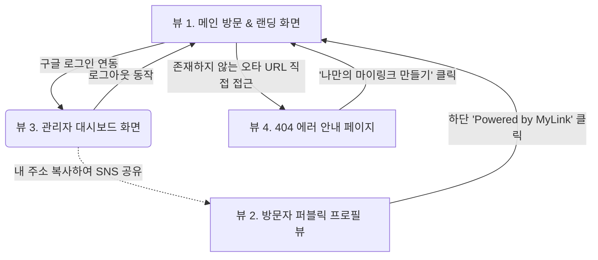

# 마이링크 (MyLink) 와이어프레임 설계도

본 문서는 마이링크 서비스의 주요 화면들에 대한 ASCII 기반 와이어프레임(구조도) 및 화면 간 이동 흐름(Mermaid)을 정의합니다.

## 0. 화면 간 이동 흐름도 (Screen Flow)


---

## 1. 뷰 1. 메인 방문 & 로그인 페이지 (Landing Page)
서비스를 처음 접하는 사용자가 서비스에 가입/로그인하기 위해 진입하는 화면입니다.

```text
+--------------------------------------------------+
|                   [ MyLink ]                     |
|                                                  |
|                                                  |
|     흩어진 당신의 링크를 단 하나로 연결하세요.   |
|                                                  |
|                                                  |
|      [ G 구글 계정으로 1초만에 시작하기 ]        |
|                                                  |
|                                                  |
|                                                  |
|             Powered by MyLink © 2026             |
+--------------------------------------------------+
```
- **핵심 요소**: 거추장스러운 안내문 없이 최중앙에 가장 명확한 구글 소셜 로그인 버튼 한 개만 배치.

---

## 2. 뷰 2. 방문자 퍼블릭 프로필 뷰 (Public View)
방문자가 특정 소유자의 주소(`mylink.com/닉네임`)를 클릭하여 들어왔을 때 최종적으로 그려지는(렌더링) 화면입니다.

```text
+--------------------------------------------------+
| [홈]                             [ 링크 복사 🔗 ]|
|                                                  |
|                   (사진 영역)                    |
|             (구글 자동배치 썸네일)               |
|                                                  |
|                  [ 유저 네임 ]                   |
|         "안녕하세요, 풀스택 개발자 OOO입니다"    |
|                                                  |
|                                                  |
|  +--------------------------------------------+  |
|  | [Favicon]     나의 첫 번째 포트폴리오      |  |
|  +--------------------------------------------+  |
|                                                  |
|  +--------------------------------------------+  |
|  | [Favicon]     깃허브(GitHub) 바로가기      |  |
|  +--------------------------------------------+  |
|                                                  |
|  +--------------------------------------------+  |
|  | [Favicon]     요즘 운영중인 유튜브 채널    |  |
|  +--------------------------------------------+  |
|                                                  |
|                                                  |
|           나만의 링크 캔버스 [ MyLink 만들기 ]   |
+--------------------------------------------------+
```
- **시각적 특징**: 좌우 여백을 두어 모바일 디바이스 비율로 중앙에 포커싱됨.
- **방문객 전환**: 맨 하단의 "MyLink 만들기"를 통해 신규 유저 유입 유도.

---

## 3. 뷰 3. 관리자 대시보드 (Admin Dashboard)
소유자가 로그인하여 자신의 링크와 프로필을 "인라인 에디팅(Inline Editing)" 방식으로 관리하는 코어 화면입니다.

```text
+--------------------------------------------------+
| [ MyLink 홈 ]           [내 URL 복사]  [로그아웃]|
+--------------------------------------------------+
|                                                  |
|                   (사진 영역)                    |
|              (읽기 전용-수정 불가)               |
|                                                  |
|                  [ 유저 네임 ✎ ]                 |
|             URL: mylink.com/[ 닉네임 ✎ ]         |
|                [ 프로필 소개글 ✎ ]               |
|                                                  |
| ------------------------------------------------ |
|                                                  |
|             [ + 새 링크 추가하기 버튼 ]          |
|                                                  |
|   (기 생성된 링크 아이템 - 클릭 시 바로 편집)    |
|  +--------------------------------------------+  |
|  | [아이콘] [Title 입력/수정 란........ ✎] | 🗑 |  |
|  |          [URL 입력/수정 란.......... ✎]      |  |
|  +--------------------------------------------+  |
|                                                  |
|  +--------------------------------------------+  |
|  | [아이콘] [나의 첫 번째 포트폴리오... ✎] | 🗑 |  |
|  |          [https://portfolio.com..... ✎]      |  |
|  +--------------------------------------------+  |
|                                                  |
|                                                  |
+--------------------------------------------------+
```
- **인라인 에디팅 동작 방식**: 입력 창을 위한 별도 페이지나 모달 띄움 없이, `✎(수정)` 가능한 위치의 텍스트 영역을 클릭하면 즉시 입력이 가능한 input(입력 상자)으로 전환됨. 
- **링크 삭제**: 버튼 블록 우측 끝에 위치한 `🗑(삭제)` 클릭 시 확인 창 띄운 뒤 즉시 항목 소멸.

---

## 4. 뷰 4. 커스텀 404 에러 페이지 (Not Found Error)
접속한 닉네임의 주소가 존재하지 않을 때 표시되는 예외 처리 화면입니다.

```text
+--------------------------------------------------+
|                                                  |
|                       :(                         |
|                                                  |
|            앗, 존재하지 않는 페이지입니다.       |
|                                                  |
|       주소를 잘못 입력하셨거나 삭제된 링크입니다.|
|                                                  |
|                                                  |
|         [ 🚀 나만의 마이링크 시작해보기 ]        |
|                                                  |
+--------------------------------------------------+
```
- **기능 설명**: 단순한 에러 안내에 그치지 않고, 무효한 페이지를 타고 온 방문자를 마이링크 사용자(가입 페이지 뷰1)로 전환시키기 위한 큰 전환 버튼을 가장 눈에 띄게 배치.
